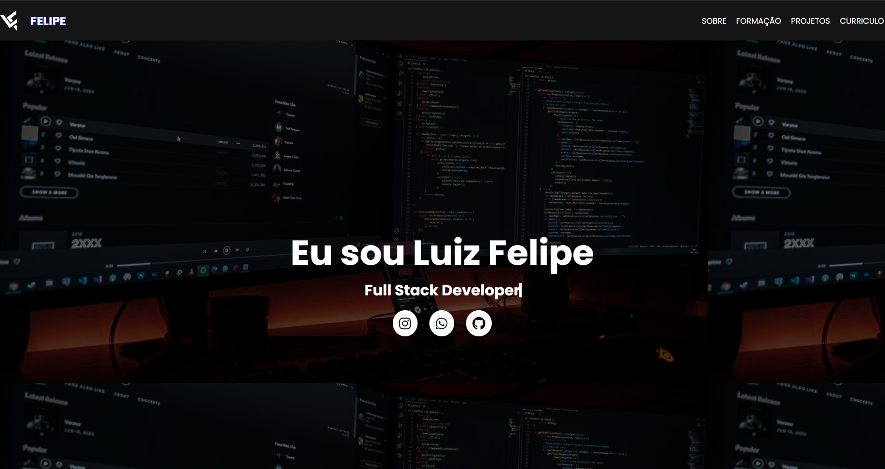

<h1 align="center">
     📰
Meu Portfólio

</h1>

<h5 align="center">
  Portfólio criado com o intuito de mostrar meus projetos e participar da avaliação da Addainto .
  </h5>

 
 

## 💻 Tecnologias utilizadas

Para o desenvolvimento deste site utilizei as seguintes tecnologias:

 * Visual Studio Code (Editor de código);

* HTML;

* JavaScript

* CSS;

## Github Pages:

https://felipefullstacker.github.io/Meu-Portifolio-Addianto/
